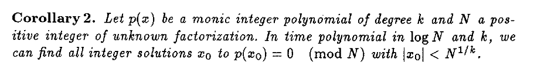
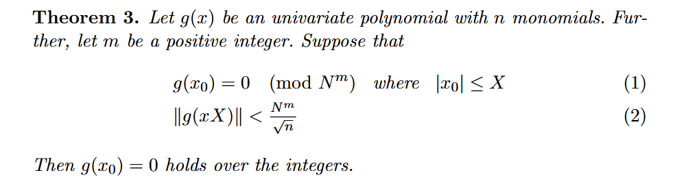
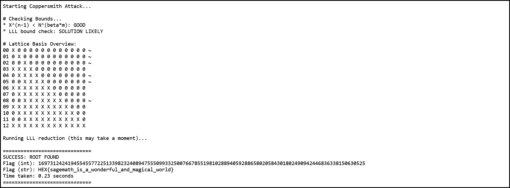
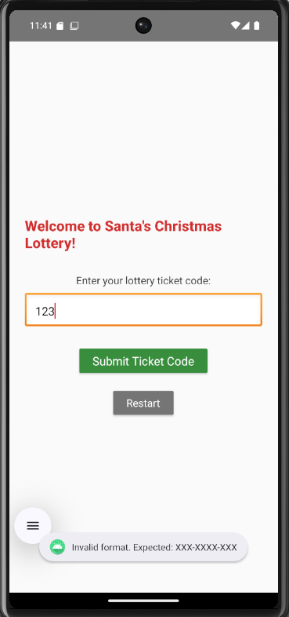
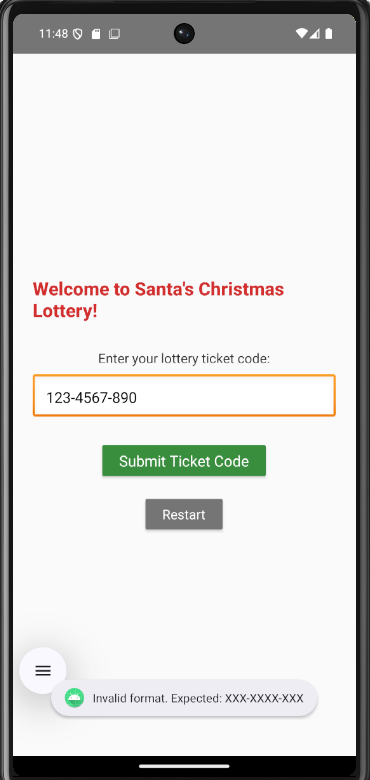
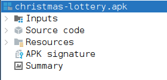
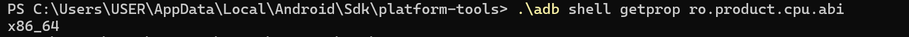
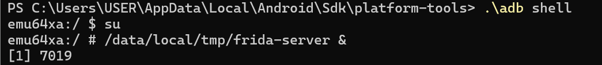
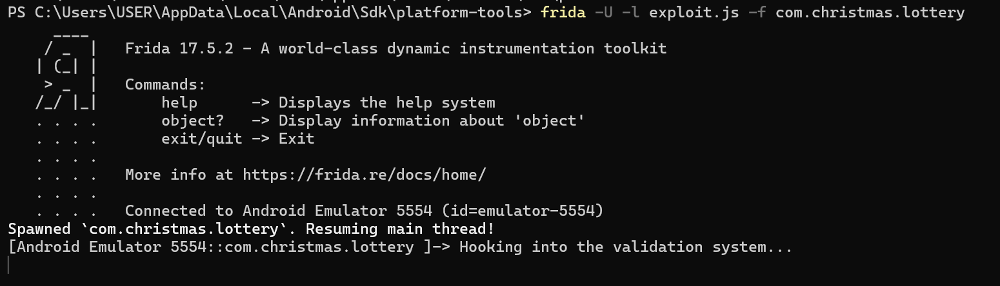
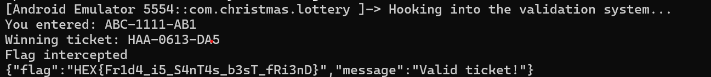

# Small and Simple Things (Crypto)

Tags: Cybersecurity

### **1. Challenge Overview**

We are given a script [chal.py](http://chal.py/). Here are its contents:

flag = int(input("Enter flag: ").encode().hex(),16)

N = 0x355ba80ed8f6ed0e3d73f1e8dd90085db632fa60f031cd5b07dafda16d8fc0787af9417481b7d52eb99b531d6d92e85be0bf2993e223c91e0a8676ae619847dba0f80e2777ebc7e90a6dfd6ef0ef5f88a035c1d5ef56c2da799f2c6fb300343dc9c61d64908e7321b250a113fcab8dc777804f31926dfddbfca1ad22b54a3e64fe164bc3b890409c495de3af192a3838521ba6be9e57c71f0e9dcd14cacb454f133b9fa5548a47799305b47f7d54bb678610cbe12fd7a0ef00e0f4918da6ed6b

c = [0x3e568d71880ec0b281944ee7bb02eb2fddd128291d072b0f0b1b7fc6967f7ca959985ea033bf847018776364d4ffdc4b6610d0070563d60086de78e0532fb94d3b370a968080b7f87ac9d175edf5ce455d92068a0965185a679c8c995ccd1b37b58fa6476c555e100d30310f8ef49e66a877747da4fd2cfc00f208741bafdf53b61392a1851af682099689b94a5ec163dd840d81377bbe0db3c6de16deeccd629c19511a90bcfa3c51c08fdc92e6b32a92d6b2291714416966512dffc1e9800a,

0x9aa3a3c39073307155aade05588c539e2079bcd0dae43092c4ae7479d3073c660f86840e6f4128a766673d2dfa36f7d79575207e1835a5f68ea1856dd5f4d6965b814ca04b962db8c10c13908722176f6658b1a772156ebc490c8bc8b71c5e490e1666613fda97b6c60dfa85b5a7c8c6a11cf3f37d9dbe9c18166067df22072ff64ca975092681906fc7ae328913648cdd8b6108d2608d58f45f7399b986a5a97266e6e81ed09ba6ce3f440fd3561d0ef7e1d758149f608acd7962308ebc416a,

0x4c357d8139d9951ea48796e145cfa7a09199020cfabf734aaab35a02e8d88cac062349c29790ae30a72ee951d801c392781e9845f2a5d0a8e3e830a026f53b24845b0d272cea249bdd1db72ef520ac5a363df374547e89425d351f394214b6514b4b9bee89279ffa9f1c9d34483be31ae48f6c2f36d4d7a554fe9984f5f7f056faa78dda25c4e848f23a06556d7d319e5e5d6db493ea09ce52ad5a27ac6f9a3b472e6d7e2f6380b1fb4f72cd4017f69114bd7c052b0ffc27de8af4f2dcecc8a6,

0x5f0cd34ee42c882d372cf1dab7e7049cb2f71a65d3be4c6107e45aaadf21be58e3e716b6fe9a42cb05e8ecd9574654539885bc95a57e2c9722231a04bb0a992d6c923a42cb9e9ea7ccca78ef6ef36b42d1208b15843c43a8793fffd2758a391383ec9272d43acd3dfa32bdb989298e2301b7092807f580882810a174329e6045f5374772fce05f0c73ea85e67b8a42bb0b541c59083d6c104c55d31d2d02cc2862b85d5a636fd11819827792a267fe2239abb332be2ea917dd448476fdd6835b]

enc = sum(i*pow(flag,n,N) for n,i in enumerate(c))%N

if enc == 0x34d45d13a2838e7e1835f747ca74355e4121f45347be4c4e589cb9e626c7be12fe10076d97c78441ed32dbd99fec99d68bb62348d947831ff324a0404c87f730aa2e8fe9c3259c84a10fabd721ae987e6821e24bc8ef079a904186ec8c6be5cbb6c8c83e5a348dc728717ff930c0eb9d4298b1b66a1cf6ffe253873cc19f859fe70af93c5395ba8779ffc8d38b3fba9253d19c0dcc876e88b1bf8aaf0c9ffa000c381a3f875690029a0bef9c9013ead80621158190a55b4cabfefc2bf0c20498:

print("Congrats! You got the right flag")

else:

print("Try again")

In the script, our flag is the unknown, we will represent it with the letter x.

The knowns are:

- N: This is given in hexadecimal format. As there are 512 characters, excluding ‘0x’ at the beginning and each hexadecimal digit is 4 bits, N is a large integer of 2048 bits.
- c: This is a list of 4 large integers, which will become the coefficients of a polynomial equation.
- enc: This is the encrypted result of our flag, obtained after passing the flag into the polynomial function and wrapping the result around the modulus N.

Translating the python code into an equation sum(i*pow(flag,n,N) for n,i in enumerate(c))%N , we get *enc* = *c*3*x*3 + *c*2*x*2 + *c*1*x* + *c*0 (*mod* *N*). The flag is the root of the equation.

Traditionally, the 2048-bit modulus N ensures security because solving for x in a modular ring is computationally equivalent to the Integer Factorization Problem. As the root evaluates to a value much larger than N, it wraps around the modulus multiple times. Without the prime factors of N, an attacker cannot determine how many wraps occurred, making it impossible to recover the flag using standard algebraic methods.

### **2. The Vulnerability**

What then allows us to bypass the encryption? There are two main factors which contribute to the vulnerability in the encryption.

1. The degree of the polynomial is small. (3 in this case)
2. The root of the equation (flag) is approximately 50 characters, which is around 400 bits. This is significantly smaller than the 2048-bit modulus.

Recall the original equation, we are given that *enc* = *c*3*x*3 + *c*2*x*2 + *c*1*x* + *c*0 (*mod* *N*). We can subtract enc from the constant *c*0  to get *f*(*x*) = *c*3*x*3 + *c*2*x*2 + *c*1*x* + *c*0  − *enc*  ≡ 0 *mod* *N*. This is a univariate modular equation, where our flag, x, is the only unknown variable.

From here, we can obtain a solution in polynomial time using Coppersmith’s method, as stated in Corollary 2.

*Figure 1: Coppersmith’s Theorem*

Corollary 2 defines an upper bound for our root. Substituting our values, we have the following inequality: $2^{400} < \ 2^{\frac{2048}{3}}$ . This specific configuration (small degree and root) violates the hardness assumptions that protect RSA-style modular equations. While finding roots of univariate polynomials over a ring of integers modulo N is generally difficult, we can now convert this into an integer space problem using Coppersmith’s algorithm!

We will delve into the details of the algorithm in the next section, but for now, here is a short summary of how it works:

The Coppersmith algorithm creates a set of helper polynomials that all share the same root, which are then scaled by a bound X. We can then arrange the polynomials into a lattice basis and use LLL reduction to find a short vector. This shortest vector corresponds to a new polynomial that has such small coefficients it satisfies the Howgrave-Graham Lemma, which justifies why the modular root is also the integer root. Intuitively, if a number is too small to wrap around N, modular equality forces real equality.

*Figure 2: Howgrave-Graham’s Theorem*

### **3. Coppersmith’s Method**

Now that we have a background understanding of Coppersmith’s algorithm, we are going to implement it with Sage. The following script is a modified version of David Wong’s implementation:

1. Constructing f(x) - When this polynomial evaluates to zero, the value of x is our recovered flag.

f = c[0] + c[1]*x + c[2]*x^2 + c[3]*x^3 - enc

1. Preprocessing - As Coppersmith’s method requires the polynomial to be monic (leading coefficient has to be 1), we first multiply the entire polynomial by the modular inverse of the leading coefficient *c*3.

f_monic = f * ZmodN(c[3])**-1

1. Define the search space - Note that this is denoted with XX in the code. As we had earlier estimated our flag size to be 400 bits, the search space will be 2400. The search space can be anything less than the *N*1/*k*, but if it is smaller than the flag size, the attack will fail.

XX = 2**400

1. Generate helper polynomials - In this step, we generate a collection of polynomials that all share the same root *x*0, but over a larger modulus *Nm*. (m is the multiplicity) These polynomials form the basis for our lattice. By using a larger modulus, we are able to generate more helper polynomials to provide the LLL algorithm with flexibility to find the optimal combination. x is also substituted with x⋅XX to create a weighted lattice that forces the LLL algorithm to prioritize minimizing the coefficients of higher-degree terms, which grow much faster.

gg = []

for ii in range(mm):

for jj in range(dd):

gg.append((x * XX)**jj * modulus**(mm - ii) * polZ(x * XX)**ii)

for ii in range(tt):

gg.append((x * XX)**ii * polZ(x * XX)**mm)

1. Construct the Lattice Basis - The helper polynomials from the previous step are placed into a matrix BB. In this case, the nested loop only populates the *iith* column of the *iith* row, resulting in a triangular matrix. This guarantees full rank, meaning that the helper polynomials are independent and provide unique information to the LLL (not redundant). It also makes it easier to calculate the determinant.

BB = Matrix(ZZ, nn)

for ii in range(nn):

for jj in range(ii+1):

BB[ii, jj] = gg[ii][jj]

1. LLL Reduction - The LLL algorithm combines the helper polynomials into a new polynomial with the smallest coefficients. The result is the shortest vector of the lattice. If it manages to find a vector small enough to satisfy the Howgrave-Graham bound, the attack has succeeded. Note that if LLL fails to find a root, the parameters XX, mm and tt can be adjusted.

BB = BB.LLL()

1. Solve for roots - Once the bound is satisfied, the modular equation can be solved over the integer space. Dividing by XX**ii undoes the scaling we had done in step 4.

new_pol = 0

for ii in range(nn):

new_pol += x**ii * BB[0, ii] / XX**ii

potential_roots = new_pol.roots()

1. Verifying the roots - By substituting potential roots back into the original polynomial f(x) and calculating the Greatest Common Divisor (GCD) with the modulus N, the script confirms whether the root satisfies the initial modular congruence *f*(*x*) ≡ 0(*mod* *N*).
2. roots = []
3. for root in potential_roots:
4. if root[0].is_integer():
5. result = polZ(ZZ(root[0]))
6. if gcd(modulus, result) >= modulus**beta:
7. roots.append(ZZ(root[0]))
8. return roots

### **4. Final Solution**

import time

import binascii

debug = True

# display matrix picture with 0 and X

def matrix_overview(BB, bound):

for ii in range(BB.dimensions()[0]):

row_str = f"{ii:02d} "

for jj in range(BB.dimensions()[1]):

row_str += '0' if BB[ii, jj] == 0 else 'X'

row_str += ' '

if BB[ii, ii] >= bound:

row_str += '~'

print(row_str)

def coppersmith_howgrave_univariate(pol, modulus, beta, mm, tt, XX):

dd = pol.degree()

nn = dd * mm + tt

if not 0 < beta <= 1:

raise ValueError("beta should belong in (0, 1]")

if not pol.is_monic():

raise ArithmeticError("Polynomial must be monic.")

if debug:

print("\n# Checking Bounds...")

cond1 = RR(XX**(nn-1))

cond2 = pow(modulus, beta*mm)

print(f"* X^(n-1) < N^(beta*m): {'GOOD' if cond1 < cond2 else 'NOT GOOD'}")

detL = RR(modulus**(dd * mm * (mm + 1) / 2) * XX**(nn * (nn - 1) / 2))

cond1 = RR(2**((nn - 1)/4) * detL**(1/nn))

cond2 = RR(modulus**(beta*mm) / sqrt(nn))

print(f"* LLL bound check: {'SOLUTION LIKELY' if cond1 < cond2 else 'UNLIKELY'}")

# change ring of pol and x

polZ = pol.change_ring(ZZ)

x = polZ.parent().gen()

# compute polynomials

gg = []

for ii in range(mm):

for jj in range(dd):

gg.append((x * XX)**jj * modulus**(mm - ii) * polZ(x * XX)**ii)

for ii in range(tt):

gg.append((x * XX)**ii * polZ(x * XX)**mm)

# construct lattice B

BB = Matrix(ZZ, nn)

for ii in range(nn):

for jj in range(ii+1):

BB[ii, jj] = gg[ii][jj]

if debug:

print("\n# Lattice Basis Overview:")

matrix_overview(BB, modulus**mm)

print("\nRunning LLL reduction (this may take a moment)...")

BB = BB.LLL() # LLL

# transform shortest vector in polynomial

new_pol = 0

for ii in range(nn):

new_pol += x**ii * BB[0, ii] / XX**ii

# factor polynomial

potential_roots = new_pol.roots()

# test roots

roots = []

for root in potential_roots:

if root[0].is_integer():

result = polZ(ZZ(root[0]))

if gcd(modulus, result) >= modulus**beta:

roots.append(ZZ(root[0]))

return roots

# add challenge data

N = 0x355ba80ed8f6ed0e3d73f1e8dd90085db632fa60f031cd5b07dafda16d8fc0787af9417481b7d52eb99b531d6d92e85be0bf2993e223c91e0a8676ae619847dba0f80e2777ebc7e90a6dfd6ef0ef5f88a035c1d5ef56c2da799f2c6fb300343dc9c61d64908e7321b250a113fcab8dc777804f31926dfddbfca1ad22b54a3e64fe164bc3b890409c495de3af192a3838521ba6be9e57c71f0e9dcd14cacb454f133b9fa5548a47799305b47f7d54bb678610cbe12fd7a0ef00e0f4918da6ed6b

c = [0x3e568d71880ec0b281944ee7bb02eb2fddd128291d072b0f0b1b7fc6967f7ca959985ea033bf847018776364d4ffdc4b6610d0070563d60086de78e0532fb94d3b370a968080b7f87ac9d175edf5ce455d92068a0965185a679c8c995ccd1b37b58fa6476c555e100d30310f8ef49e66a877747da4fd2cfc00f208741bafdf53b61392a1851af682099689b94a5ec163dd840d81377bbe0db3c6de16deeccd629c19511a90bcfa3c51c08fdc92e6b32a92d6b2291714416966512dffc1e9800a,

0x9aa3a3c39073307155aade05588c539e2079bcd0dae43092c4ae7479d3073c660f86840e6f4128a766673d2dfa36f7d79575207e1835a5f68ea1856dd5f4d6965b814ca04b962db8c10c13908722176f6658b1a772156ebc490c8bc8b71c5e490e1666613fda97b6c60dfa85b5a7c8c6a11cf3f37d9dbe9c18166067df22072ff64ca975092681906fc7ae328913648cdd8b6108d2608d58f45f7399b986a5a97266e6e81ed09ba6ce3f440fd3561d0ef7e1d758149f608acd7962308ebc416a,

0x4c357d8139d9951ea48796e145cfa7a09199020cfabf734aaab35a02e8d88cac062349c29790ae30a72ee951d801c392781e9845f2a5d0a8e3e830a026f53b24845b0d272cea249bdd1db72ef520ac5a363df374547e89425d351f394214b6514b4b9bee89279ffa9f1c9d34483be31ae48f6c2f36d4d7a554fe9984f5f7f056faa78dda25c4e848f23a06556d7d319e5e5d6db493ea09ce52ad5a27ac6f9a3b472e6d7e2f6380b1fb4f72cd4017f69114bd7c052b0ffc27de8af4f2dcecc8a6,

0x5f0cd34ee42c882d372cf1dab7e7049cb2f71a65d3be4c6107e45aaadf21be58e3e716b6fe9a42cb05e8ecd9574654539885bc95a57e2c9722231a04bb0a992d6c923a42cb9e9ea7ccca78ef6ef36b42d1208b15843c43a8793fffd2758a391383ec9272d43acd3dfa32bdb989298e2301b7092807f580882810a174329e6045f5374772fce05f0c73ea85e67b8a42bb0b541c59083d6c104c55d31d2d02cc2862b85d5a636fd11819827792a267fe2239abb332be2ea917dd448476fdd6835b]

enc = 0x34d45d13a2838e7e1835f747ca74355e4121f45347be4c4e589cb9e626c7be12fe10076d97c78441ed32dbd99fec99d68bb62348d947831ff324a0404c87f730aa2e8fe9c3259c84a10fabd721ae987e6821e24bc8ef079a904186ec8c6be5cbb6c8c83e5a348dc728717ff930c0eb9d4298b1b66a1cf6ffe253873cc19f859fe70af93c5395ba8779ffc8d38b3fba9253d19c0dcc876e88b1bf8aaf0c9ffa000c381a3f875690029a0bef9c9013ead80621158190a55b4cabfefc2bf0c20498

# setup Polynomial Ring

ZmodN = Zmod(N)

P.<x> = PolynomialRing(ZmodN)

# build f(x) and make it monic

f = c[0] + c[1]*x + c[2]*x^2 + c[3]*x^3 - enc

f_monic = f * ZmodN(c[3])**-1

# attack parameters

beta = 1.0

XX = 2**400

mm = 4

tt = 1

print("Starting Coppersmith Attack...")

start_time = time.time()

roots = coppersmith_howgrave_univariate(f_monic, N, beta, mm, tt, XX)

if roots:

print(f"\n{'='*30}")

print("SUCCESS: ROOT FOUND")

flag_int = int(roots[0])

flag_hex = f"{flag_int:x}"

if len(flag_hex) % 2 != 0:

flag_hex = '0' + flag_hex

print(f"Flag (int): {flag_int}")

print(f"Flag (str): {binascii.unhexlify(flag_hex).decode()}")

print(f"Time taken: {time.time() - start_time:.2f} seconds")

print(f"{'='*30}")

else:

print("\n[!] Failure: No root found. Try increasing mm/tt or XX.")

Figure 3: Sage Cell output

**Parameters:**

- XX = 2400

This is the root bound. Set it to the estimated flag size and increase if the attack fails.

- mm = 4

This is the multiplicity. A higher mm makes the math easier but the script slower. Increase if the script’s LLL bound check says UNLIKELY.

- tt = 1

This is the number of extra shifts. Adding more shifts increases the lattice dimension and improves the chances of finding a shorter vector, but it also increases runtime.

Also, the lattice dimensions (nn) are given by *dd* × *mm* + *tt*.

### **5. Flag Recovery**

After running the LLL reduction, the shortest vector provided a polynomial whose integer root was:

- **Integer Root:** 169731242419455455772251339823240894755509933250076678551981028894059288658020584301802490942446836338150630525
- **Decoded Flag:** HEX{sagemath_is_a_wonderful_and_magical_world}

### **6. Learning Resources**

- Survey: Lattice Reduction Attacks on RSA by David Wong (2015): [https://www.davidwong.fr/papers/david_wong_rsa_lll_boneh_durfee__2015.pdf](https://www.davidwong.fr/papers/david_wong_rsa_lll_boneh_durfee__2015.pdf)
- Finding a Small Root of a Univariate Modular Equation by Don Coppersmith (1996): [https://static.aminer.org/pdf/PDF/000/192/854/finding_a_small_root_of_a_univariate_modular_equation.pdf](https://static.aminer.org/pdf/PDF/000/192/854/finding_a_small_root_of_a_univariate_modular_equation.pdf)
- Finding small roots of univariate modular equations revisited by Nicholas Howgrave-Graham (1997): [https://link.springer.com/chapter/10.1007/bfb0024458](https://link.springer.com/chapter/10.1007/bfb0024458)

Christmas Lottery

## **Christmas Lottery (Rev)**

### **1. Challenge Overview**

We are provided with an apk file. Let’s run it on an emulator to see what it looks like. For this challenge, we will be using Pixel_6_API_36_x86_64 via the emulator on Android Studio. You can use any device that includes the Google APIs system image, which is the development build that allows for root access. Avoid the Google Play Store image as those are production builds that are locked down for security and makes it harder for us to run Frida-server, which we will need later. Alternatively, Genymotion will work as well. Here is the result:

We see an input field, which asks for a ticket code. Entering a random input, such as 123, triggers a response from the backend that reveals the expected ticket format “XXX-XXXX-XXX”. To bypass the filter, I made another attempt to guess the ticket code, this time entering 123-4567-890. The error message returned was the same, suggesting that the server does not simply check for input length and dashes. To understand the application logic more deeply, we can perform static analysis on the reversed source code.

### **2. Static Analysis**

To obtain the source code, we can use [decompiler.com](http://decompiler.com/) or jadx-gui. The difference is that one runs on the cloud and the other runs locally. Since I already have jadx-gui installed, we will be using jadx-gui for this challenge. When we open the apk in jadx, the reversed application is structured into the following folders.

To find the entry point for our application, we can go to Resources>AndroidManifest.xml and look for the <activity> tag that contains the MainActivity string. (“com.christmas.lottery.MainActivity”) Click on the string to open the source code for MainActivity:

**package** com.christmas.lottery;

**import** W1.B;

**import** W1.x;

**import** a1.g;

**import** android.os.Bundle;

**import** android.widget.Button;

**import** android.widget.EditText;

**import** android.widget.TextView;

**import** android.widget.Toast;

**import** com.google.android.gms.tasks.Task;

**import** com.google.android.gms.tasks.Tasks;

**import** com.google.firebase.auth.FirebaseAuth;

**import** d.AbstractActivityC0235o;

**import** d.C0233m;

**import** d.C0234n;

**import** h.q;

**import** i.C0291B;

**import** i.RunnableC0314k;

**import** i1.AbstractC0365l;

**import** i1.C0359f;

**import** j1.C0384c;

**import** j1.F;

**import** java.util.concurrent.ExecutorService;

**import** java.util.concurrent.Executors;

**import** org.json.JSONException;

**import** org.json.JSONObject;

**import** s0.AbstractC0458b;

**import** s0.AbstractC0459c;

**import** s0.AbstractC0460d;

**import** s0.ViewOnClickListenerC0457a;

*/* loaded from: classes.dex */*

**public** **class** MainActivity **extends** AbstractActivityC0235o {

**private** String backendUrl;

**private** ExecutorService executorService;

**private** x httpClient;

**private** FirebaseAuth mAuth;

**private** **long** secretSeed;

**public** MainActivity() {

getSavedStateRegistry().c("androidx:appcompat", **new** C0233m(**this**, 0));

addOnContextAvailableListener(**new** C0234n(**this**));

}

**private** **int** calculateChecksum(String str) {

**int** numericValue = 0;

**for** (**char** c3 : str.toCharArray()) {

numericValue = (Character.isDigit(c3) ? Character.getNumericValue(c3) : c3 - '@') + numericValue;

}

**return** numericValue % 10;

}

**private** String generateTicketCode() {

StringBuilder sb = **new** StringBuilder();

**for** (**int** i3 = 0; i3 < 3; i3++) {

sb.append("ABCDEFGHJKLMNPQRSTUVWXYZ".charAt((**int**) ((**this**.secretSeed >> (i3 * 3)) % 24)));

}

sb.append("-");

**for** (**int** i4 = 0; i4 < 4; i4++) {

sb.append("0123456789".charAt((**int**) ((**this**.secretSeed >> ((i4 * 4) + 9)) % 10)));

}

sb.append("-");

**for** (**int** i5 = 0; i5 < 2; i5++) {

sb.append("ABCDEFGHJKLMNPQRSTUVWXYZ".charAt((**int**) ((**this**.secretSeed >> ((i5 * 5) + 25)) % 24)));

}

sb.append("0123456789".charAt(calculateChecksum(sb.toString().replace("-", "")) % 10));

**return** sb.toString();

}

*/* JADX INFO: Access modifiers changed from: private */*

**public** **void** handleValidateResponse(B b3, JSONObject jSONObject) **throws** JSONException {

**try** {

**int** i3 = b3.f927d;

**if** (200 > i3 || i3 >= 300 || !jSONObject.has("flag")) {

Toast.makeText(**this**, jSONObject.optString("error", "Invalid ticket code"), 0).show();

**return**;

}

Toast.makeText(**this**, "Valid ticket! Flag: " + jSONObject.getString("flag"), 1).show();

} **catch** (JSONException e3) {

**throw** **new** RuntimeException(e3);

}

}

*/* JADX INFO: Access modifiers changed from: private */*

**public** **void** requestSeedFromBackend(String str) {

**this**.executorService.execute(**new** RunnableC0314k(8, **this**, str));

}

*/* JADX INFO: Access modifiers changed from: private */*

**public** **void** signInAnonymouslyAndInitSeed() {

Task<Object> taskZza;

**this**.mAuth.a();

FirebaseAuth firebaseAuth = **this**.mAuth;

AbstractC0365l abstractC0365l = firebaseAuth.f2530f;

**if** (abstractC0365l == **null** || !abstractC0365l.c()) {

taskZza = firebaseAuth.f2529e.zza(firebaseAuth.f2525a, **new** C0359f(firebaseAuth), firebaseAuth.f2533i);

} **else** {

C0384c c0384c = (C0384c) firebaseAuth.f2530f;

c0384c.f3844m = false;

taskZza = Tasks.forResult(**new** F(c0384c));

}

taskZza.addOnCompleteListener(**this**, **new** q(**this**, 15));

}

*/* JADX INFO: Access modifiers changed from: private */*

**public** **void** validateTicketCodeWithBackend(String str) {

AbstractC0365l abstractC0365l = **this**.mAuth.f2530f;

**if** (abstractC0365l == **null**) {

Toast.makeText(**this**, "Not authenticated. Please wait...", 0).show();

} **else** {

FirebaseAuth.getInstance(g.e(((C0384c) abstractC0365l).f3837c)).b(abstractC0365l, false).addOnCompleteListener(**new** C0291B(**this**, str));

}

}

@Override *// androidx.fragment.app.AbstractActivityC0123s, androidx.activity.ComponentActivity, L.l, android.app.Activity*

**public** **void** onCreate(Bundle bundle) {

**super**.onCreate(bundle);

setContentView(AbstractC0459c.activity_main);

**this**.mAuth = FirebaseAuth.getInstance();

**this**.httpClient = **new** x();

**this**.executorService = Executors.newSingleThreadExecutor();

**this**.backendUrl = getString(AbstractC0460d.backend_url);

TextView textView = (TextView) findViewById(AbstractC0458b.greetingText);

EditText editText = (EditText) findViewById(AbstractC0458b.ticketCodeInput);

Button button = (Button) findViewById(AbstractC0458b.clickButton);

Button button2 = (Button) findViewById(AbstractC0458b.restartButton);

textView.setText("Welcome to Santa's Christmas Lottery!");

signInAnonymouslyAndInitSeed();

button.setOnClickListener(**new** ViewOnClickListenerC0457a(**this**, editText, 0));

button2.setOnClickListener(**new** ViewOnClickListenerC0457a(**this**, editText, 1));

}

@Override *// d.AbstractActivityC0235o, androidx.fragment.app.AbstractActivityC0123s, android.app.Activity*

**public** **void** onDestroy() {

**super**.onDestroy();

ExecutorService executorService = **this**.executorService;

**if** (executorService != **null**) {

executorService.shutdown();

}

}

}

Analysing the code, we can confirm from handleValidateResponse() that the flag is not hardcoded and instead, it is returned from a remote backend after the server has received a successfully validated ticket code. Our next task would therefore be to figure out the valid ticket code.

Taking a look at the generateTicketCode() method, we learn that for a ticket to be considered valid, its first 3 characters have to be alphabets, followed by 4 numerals, 2 alphabets and a final check digit. The check digit is based on the calculateChecksum(String str) method, which ensures mathematical integrity of the ticket. We now understand why the earlier guess of 123-4567-890 had resulted in a format error despite meeting the length and hyphen requirements!

Even though we now know what format the server expects, it will still be difficult to manually guess the ticket code due to the sheer number of possible combinations. This application uses 24 characters of the alphabet “ABCDEFGHJKLMNPQRSTUVWXYZ” and 10 digits 0-9, in total, there are 243 × 104 × 242 × 1 = 79, 626, 240, 000 combinations. Manually testing for the ticket code when there are as many as 79.6 billion possibilities will take too long. Not to mention, we will have to send our guess to a server and will thus likely be rate limited so automated testing won’t work as well. To increase the security of this application, the ticket code is also tied to a secretSeed that is likely session-based. This makes brute force computationally and operationally infeasible as the winning ticket may change every time we restart our attack.

What then is the vulnerability in this application? Even though we don’t have access to the secretSeed (sent by the server), the logic for generating the ticket code from the seed is exposed in the client code. The server, however, assumes that any valid ticket it receives was obtained through legitimate means. It neglects the fact that the client knows how to generate the ticket and thus attackers can perform method hooking and observe runtime behaviour to obtain the flag. In the next part, we will be going through how we can use Frida, a dynamic instrumentation toolkit for this task.

### **3. Dynamic Analysis**

As always, the first step is setting up our environment. To install frida, you can run “pip install frida-tools”. To learn more about Frida, refer to the [documentation](https://frida.re/docs/installation/). Afterwards, it is also important to download the matching Frida server from the [Frida Github Releases](https://github.com/frida/frida/releases) page. As my emulator runs on x86_64, I will be using frida-server-17.5.2-android-x86_64.xz for this challenge. You can run “.\adb shell getprop ro.product.cpu.abi” to help you pick the right Frida download.

Once you have downloaded and extracted the .xz file, you have to push the server to the Android device’s internal filesystem. This can be done with “.\adb push frida-server /data/local/tmp/”. We will also make the server executable on our Android with “.\adb shell chmod 755 /data/local/tmp/frida-server”.

That’s all for the setup. Before continuing, run “frida-ps -U” to list all running processes on our Android. This allows us to verify that the host PC is able to communicate with the Android device correctly. You can read more about the command [here](https://frida.re/docs/frida-ps/).

Now we can begin the most exciting part which is to write the exploit. We will create a file called [exploit.js](http://exploit.js/) that hooks the validateTicketCodeWithBackend() method. When the user interacts with the UI, the script intercepts the execution flow, forcing the app to call its internal generateTicketCode() method. It then replaces the captured user input with this programmatically generated winning ticket before it is sent to the server. The script also hooks handleValidateResponse() to log the raw JSON response from the server directly to the terminal, where we can retrieve our flag even if the notification in the UI disappears too quickly.

Java.perform(function () {

var MainActivity = Java.use("com.christmas.lottery.MainActivity");

console.log("Hooking into the validation system...");

// This intercepts the moment you click 'Validate'

MainActivity.validateTicketCodeWithBackend.implementation = function (userInput) {

console.log("You entered: " + userInput);

// We ask the app to generate the perfect ticket for us

var winningTicket = this.generateTicketCode();

console.log("Winning ticket: " + winningTicket);

// We send the perfect ticket to the server instead of yours!

return this.validateTicketCodeWithBackend(winningTicket);

};

// This catches the response from the server

MainActivity.handleValidateResponse.implementation = function (res, json) {

console.log("Flag intercepted");

console.log(json.toString());

return this.handleValidateResponse(res, json);

};

});

To run [exploit.js](http://exploit.js/) on our android device, we need to first root it. Run “.\adb shell” followed by “su” which stands for superuser. Notice the $ sign change to a # sign, which indicates that we have successfully rooted the device! Start the Frida server with “/data/local/tmp/frida-server &”.

As [exploit.js](http://exploit.js/) exists only on our host PC, we will open a new terminal to access it. Type “frida -U -l exploit.js -f com.christmas.lottery” to load the script into our Android app’s memory. You should see a Frida banner along with confirmation that com.christmas.lottery has been “Spawned”.

We are left with the final step. Enter any random input in the UI and you should see the flag appear as both a notification and a console message. As you can see, our flag is HEX{Fr1d4_i5_S4nT4s_b3sT_fRi3nD}.

Merry Osintmas

## **Merry Osintmas (OSINT)**

### **1. Challenge Overview**

While OSINT can be divided into many categories, we will focus on GEOINT in this writeup. Given 5 different google street views, we are tasked to geolocate its exact coordinates.

### **2. Difficulty Level:**

### **3. Resources**

Querying Flags

## **Querying Flags (Web)**

Santa's Message

## **Santa’s Message (Forensics)**

Chirstmas Wishlist

## **Christmas Wishlist (Web)**

Chirstmas Tree

## **Christmas Tree (Rev)**

Hex xor Bin

Tab 9

particle effects, like video editor, add and drag

one after another

shift camera while particle effect

fade in transitions show time

normal black is a transition